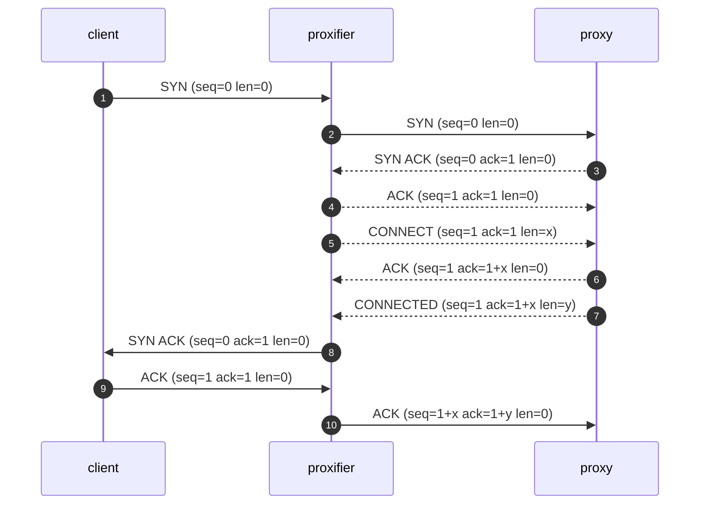

## Connection Establishment

```mermaid
sequenceDiagram
autonumber
client->>proxifier: SYN (seq=0 len=0)
proxifier->>proxy: SYN (seq=0 len=0)
proxy-->>proxifier: SYN ACK (seq=0 ack=1 len=0)
proxifier-->>proxy: ACK (seq=1 ack=1 len=0)
proxifier-->>proxy: CONNECT (seq=1 ack=1 len=x)
proxy-->>proxifier: ACK (seq=1 ack=1+x len=0)
proxy-->>proxifier: CONNECTED (seq=1 ack=1+x len=y)
proxifier->>client: SYN ACK (seq=0 ack=1 len=0)
client->>proxifier: ACK (seq=1 ack=1 len=0)
proxifier->>proxy: ACK (seq=1+x ack=1+y len=0)
```
